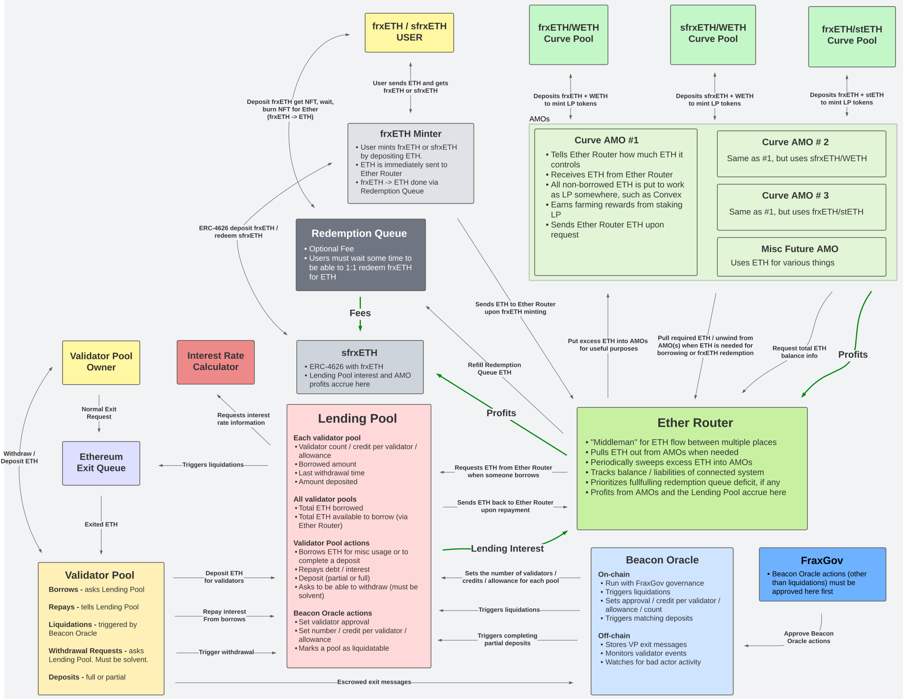

# Frax Staked Ethereum V2
## Flowchart


<!-- //////////////////////////////////////////////////////////////// -->
# Building and Testing
### Forge
1) ```forge build```
2) Change submodules to ds-test@e282159d5170298eb2455a6c05280ab5a73a4ef0, forge-std@80a8f6ea9362849b2a8f2dc28df40c77a64f9c16, and frax-standard-solidity@2260f3867333f5906e97500fb0d91274682860d0
3) ```forge test```


If you need to fork mainnet, single test contract
```source .env && forge test --fork-url $MAINNET_RPC_URL -vv --match-path ./src/test/ABCXYZ.t.sol```

### Deploy
Etherscan
```source .env && forge script src/script/DeployAll.s.sol:DeployAll --chain-id 1 --with-gas-price 11000000000 --priority-gas-price 1000000000 --rpc-url $MAINNET_RPC_URL --optimize --optimizer-runs 800 --use "0.8.28" --evm-version "cancun" --private-key $PK --slow --broadcast --verify```

Holesky
```source .env && forge script src/script/DeployFraxEtherMinter.s.sol:DeployFraxEtherMinter --chain-id 17000 --with-gas-price 1000000000 --priority-gas-price 100000000 --rpc-url $HOLESKY_RPC_URL --optimize --optimizer-runs 800 --use "0.8.28" --evm-version "cancun" --private-key $PK --broadcast```

## Verification
### Regular contracts
Try using forge verify-contract first
1) ```source .env && forge verify-contract --chain-id 17000 --watch --num-of-optimizations 800 --constructor-args 0x00000000000000000000000017845ea6a9bfd2caf1b9e558948bb4999df2656e000000000000000000000000625e700125ff054f75e5348497cbfab1ee4b7a4000000000000000000000000061e76013b7ad7e00e47c9b163a8fac245e05c64f00000000000000000000000000a5b34d4b436e3276695a1eaa8242fa2fc11dc5000000000000000000000000d63ed766baf84a98f9a7a33e00a59d7c1f29e6010000000000000000000000000af57786d6b2447ea2e04f9fab36a239c2e8c9d5000000000000000000000000000000000000000000000000000000075e73a8b0 0x6AF0e3eCE7Cfb983CDC2592E6dfeCb9bBA062a6F src/contracts/lending-pool/LendingPool.sol:LendingPool```
2) OR (1) but with ```--show-standard-json-input``` and paste that into the verifier


If this fails, try `forge flatten`
```forge flatten --output src/flattened.sol src/contracts/ValidatorPool.sol && sed -i '/SPDX-License-Identifier/d' ./src/flattened.sol && sed -i '/pragma solidity/d' ./src/flattened.sol && sed -i '1s/^/\/\/ SPDX-License-Identifier: GPL-2.0-or-later\npragma solidity >=0.8.0;\n\n/' ./src/flattened.sol```
